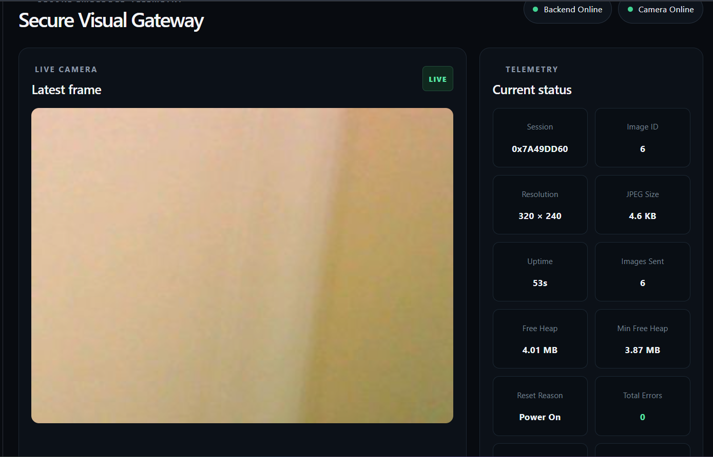
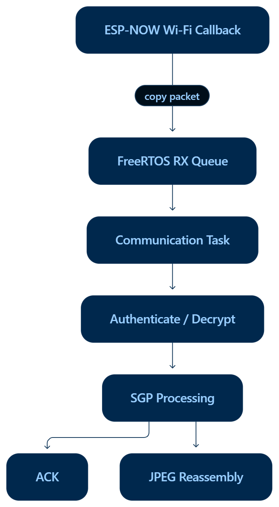

# Secure Visual Gateway

[](https://github.com/berhankokum/secure-visual-gateway/actions/workflows/ci.yml)

Secure Visual Gateway is an embedded visual telemetry system built with ESP32-based devices.

An ESP32-CAM captures images and sends them wirelessly to a gateway using a custom secure protocol over ESP-NOW. The gateway reconstructs the image and forwards it to a PC, where a Python receiver sends the data to a FastAPI backend. A React + TypeScript dashboard displays live images and device telemetry.

---

## System Overview

```text
GC2145 Camera
      |
      v
ESP32-CAM
Camera Node
      |
      | RGB565 Capture
      | Software JPEG Encoding
      |
      v
Secure Gateway Protocol (SGP)
      |
      | HMAC-SHA256 Handshake
      | HKDF-SHA256 Session Keys
      | AES-256-GCM Encryption
      | Sequence Numbers
      | ACK / Retry
      | Image Fragmentation
      |
      v
ESP-NOW
      |
      v
Deneyap Kart 1A
Gateway
      |
      | JPEG Reassembly
      | USB Serial / Base64
      |
      v
Python Serial Receiver
      |
      v
FastAPI Backend
      |
      +---- SQLite Metadata
      |
      +---- JPEG Storage
      |
      v
React + TypeScript Dashboard
```

---

## Features

- ESP32-CAM image acquisition
- GC2145 RGB565 capture
- Software JPEG conversion
- ESP-NOW communication
- Custom binary protocol
- Session-based communication
- Application-level ACK mechanism
- Timeout and retry handling
- Duplicate packet detection
- Sequence validation
- HMAC-SHA256 authenticated handshake
- HKDF-SHA256 session-key derivation
- AES-256-GCM authenticated encryption
- Encrypted image fragmentation and transfer
- JPEG reconstruction on the gateway
- FreeRTOS queue-based packet processing
- Device telemetry
- Reset reason reporting
- Heap monitoring
- Image and error counters
- USB serial image export
- Python serial receiver
- FastAPI REST API
- SQLite metadata storage
- React + TypeScript monitoring dashboard
- Automated backend and protocol tests
- GitHub Actions CI for backend, dashboard and firmware builds

---

## Hardware

### Camera Node

- ESP32-CAM
- GC2145 camera sensor
- PSRAM
- 470 uF electrolytic capacitor for power stabilization

### Gateway

- Deneyap Kart 1A
- ESP32-WROVER-E

### Communication

- ESP-NOW
- Wi-Fi channel configured in `sgp_device_config.h`

---

## Repository Structure

```text
secure-visual-gateway/
|
+-- firmware/
|   |
|   +-- camera_node/
|   |
|   +-- gateway/
|   |
|   +-- components/
|       |
|       +-- sgp_config/
|       +-- sgp_protocol/
|       +-- sgp_security/
|       +-- sgp_crypto/
|       +-- sgp_image/
|       +-- sgp_telemetry/
|       +-- sgp_serial_export/
|
+-- tools/
|   |
|   +-- gateway_serial_receiver/
|   +-- generate_secrets.py
|
+-- backend/
|
+-- dashboard/
|
+-- docs/
|
+-- tests/
|
+-- .github/
|   +-- workflows/
|       +-- ci.yml
|
+-- .gitignore
+-- pytest.ini
+-- LICENSE
+-- README.md
```

The Deneyap ESP32-CAM UART programming bridge used during development is intentionally excluded from this repository and can be maintained as a separate reusable project.

---

## Dashboard



The dashboard shows the latest received frame together with live device and backend telemetry.

---

## Secure Gateway Protocol

SGP is the custom application protocol used between the Camera Node and Gateway.

The protocol provides:

```text
Protocol Version
Message Type
Flags
Session ID
Sequence Number
Payload
Authentication / Encryption
```

A Camera Node generates a new random session ID after every boot.

Communication starts with an authenticated HMAC handshake. Both devices then derive session encryption keys using HKDF-SHA256.

Application traffic is protected using AES-256-GCM.

See `docs/protocol.md` for protocol details.

---

## Security Model

The current implementation includes:

- HMAC-SHA256 authentication
- 128-bit truncated HMAC tags during handshake
- HKDF-SHA256 key derivation
- Independent Camera-to-Gateway and Gateway-to-Camera keys
- AES-256-GCM authenticated encryption
- Session identifiers
- Sequence validation
- Duplicate detection
- Stale-packet rejection

Development secrets are generated locally with:

```powershell
python tools\generate_secrets.py
```

The generated file:

```text
firmware/components/sgp_config/include/sgp_secrets.h
```

is intentionally excluded from Git.

The tracked file `sgp_secrets.example.h` contains placeholders only.

> The generated header being excluded from Git provides repository secret hygiene only; it is not hardware-backed key protection. Production deployments should use secure provisioning and protected key storage.

---

## Build Requirements

### Firmware

- ESP-IDF 6.1
- ESP32 toolchain
- Python
- esptool

### Backend

- Python 3
- FastAPI
- Uvicorn

### Dashboard

- Node.js
- npm
- React
- TypeScript
- Vite

---

## Generate Development Secrets

From the repository root:

```powershell
python tools\generate_secrets.py
```

Verify that this file exists:

```text
firmware/components/sgp_config/include/sgp_secrets.h
```

Do not commit it.

---

## Build Camera Node

```powershell
cd firmware\camera_node
idf.py build
```

---

## Build Gateway

```powershell
cd firmware\gateway
idf.py build
```

---

## ESP32-CAM Programming

Because the ESP32-CAM used in this project does not have a dedicated USB-to-UART adapter, the Deneyap board can temporarily operate as an active UART bridge.

Bridge connections:

```text
DENEYAP                    ESP32-CAM

5V ----------------------> 5V
GND ---------------------> GND

D0 / GPIO23 -------------> U0R
D1 / GPIO22 <------------- U0T

ESP32-CAM IO0 -----------> GND
```

Flash the bridge:

```powershell
cd tools\deneyap_uart_bridge
idf.py -p COM9 flash
```

Then flash the Camera Node:

```powershell
cd firmware\camera_node\build

python -m esptool --chip esp32 -p COM9 -b 115200 --before no-reset --after no-reset write-flash "@flash_args"
```

After programming, disconnect `IO0` from GND.

---

## Normal Runtime Wiring

During normal operation only power is required between the Gateway and Camera Node:

```text
DENEYAP                    ESP32-CAM

5V ----------------------> 5V
GND ---------------------> GND
```

A 470 uF capacitor is connected across the ESP32-CAM power input:

```text
ESP32-CAM 5V ---- (+ 470 uF -) ---- ESP32-CAM GND
```

Observe capacitor polarity.

---

## Run Backend

```powershell
cd backend

.\.venv\Scripts\python.exe -m uvicorn main:app --host 127.0.0.1 --port 8000
```

Health endpoint:

```text
http://127.0.0.1:8000/api/health
```

Latest image metadata:

```text
http://127.0.0.1:8000/api/images/latest
```

Latest Camera Node telemetry:

```text
http://127.0.0.1:8000/api/status/latest
```

---

## Run Serial Receiver

```powershell
cd tools\gateway_serial_receiver

python receiver.py --port COM9 --baud 115200
```

The receiver:

1. reads JPEG data exported by the Gateway,
2. validates the JPEG,
3. stores a local copy,
4. uploads it to the FastAPI backend,
5. forwards device telemetry to the backend.

---

## Run Dashboard

```powershell
cd dashboard

npm install
npm run dev
```

Open:

```text
http://localhost:5173
```

The dashboard shows:

- latest camera frame,
- Camera Node online/offline state,
- backend state,
- session ID,
- image ID,
- resolution,
- JPEG size,
- uptime,
- images sent,
- current free heap,
- minimum free heap,
- reset reason,
- capture failures,
- transfer failures,
- image history.

---

## API Endpoints

```text
GET  /api/health
GET  /api/images
GET  /api/images/latest
POST /api/images

GET  /api/status/latest
POST /api/status

GET  /images/<filename>
```

---

## Current Image Pipeline

```text
GC2145
  |
  | RGB565
  v
ESP32-CAM PSRAM
  |
  | frame2jpg()
  v
JPEG
  |
  | split into chunks
  v
AES-256-GCM encrypted SGP packets
  |
  v
ESP-NOW
  |
  v
Gateway
  |
  | decrypt
  | validate
  | reconstruct
  v
JPEG
  |
  v
Serial Export
  |
  v
Python Receiver
  |
  v
FastAPI
  |
  v
Dashboard
```

---

## Reliability

The communication layer implements:

```text
Send
 |
 v
Wait for application ACK
 |
 +---- ACK received ------> continue
 |
 +---- timeout -----------> retry
                              |
                              +--> maximum retry limit
```

Duplicate packets are acknowledged again without repeating the application-level operation.

---

## Gateway FreeRTOS Receive Architecture



The Gateway keeps the ESP-NOW Wi-Fi callback intentionally short. Incoming packets are copied into a FreeRTOS RX queue and processed by a dedicated communication task.

```text
ESP-NOW Wi-Fi Callback
        |
        | copy packet
        v
FreeRTOS RX Queue
        |
        v
Communication Task
        |
        v
Authenticate / Decrypt
        |
        v
SGP Processing
       / \
      /   \
     v     v
   ACK   JPEG Reassembly
```

This design prevents authentication, decryption, protocol handling, and JPEG reassembly from blocking the Wi-Fi callback context.

---

## Telemetry

Camera Node telemetry currently includes:

```text
Session ID
Reset Reason
Uptime
Free Heap
Minimum Free Heap
Images Sent
Capture Failures
Transfer Failures
```

Telemetry is encrypted using the same secure SGP session.

---

## Automated Tests

The repository includes backend API and SGP protocol contract tests.

Run from the repository root:

```powershell
python -m pytest
```

Current suite: **20 tests** covering backend image/telemetry flows, duplicate handling, invalid-input rejection, SGP header layout, big-endian encoding, message types, image constants and telemetry constants.

---

## Continuous Integration

GitHub Actions runs automatically on pushes and pull requests to `main`. The CI pipeline validates:

```text
Python Tests
Dashboard Build
Firmware - Camera Node
Firmware - Gateway
```

Firmware jobs build against ESP-IDF 6.1 for the ESP32 target. CI generates temporary development secrets during the runner lifetime so real runtime secrets do not need to be stored in Git.

---

## Current Limitations

- Camera resolution is currently QVGA (320x240).
- GC2145 does not provide native JPEG output, so JPEG conversion is performed in software.
- Secret provisioning is development-oriented.
- ESP-NOW peers are statically configured.
- The backend currently targets local development.
- Device firmware updates are performed manually.
- The dashboard currently uses HTTP polling rather than WebSocket/SSE streaming.
- The current protocol uses a 32-bit session ID and is intended as a prototype rather than a production provisioning design.
- The current implementation targets one Camera Node / Gateway pair.

---

## Future Improvements

Possible extensions include:

- secure hardware-backed key storage,
- NVS-based provisioning,
- WebSocket/SSE dashboard updates,
- OTA firmware updates,
- configurable capture rates,
- higher-resolution image transfer,
- image checksums and persistent transfer metrics,
- multiple Camera Nodes,
- Wi-Fi/Ethernet cloud gateway support,
- backend authentication,
- containerized deployment,
- automated tests and CI.

---

## Development Status

The current prototype supports complete end-to-end encrypted image telemetry:

```text
Camera Capture
    ✓

JPEG Conversion
    ✓

Secure Session Establishment
    ✓

AES-GCM Image Transfer
    ✓

ACK / Retry
    ✓

Gateway Reassembly
    ✓

JPEG Validation
    ✓

PC Serial Export
    ✓

Backend Storage
    ✓

Device Telemetry
    ✓

React Dashboard
    ✓
```

---

## License

This project is licensed under the MIT License. See [`LICENSE`](LICENSE).
